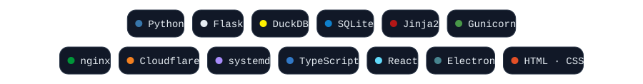

I build small web products end to end — scraping and data pipelines, Flask backends, programmatic SEO, deployment and monitoring — and then keep them running in production. Three of them are live right now:

 
Case studies: <a href="https://github.com/klaschukk/prevozni.com">prevozni.com</a> · <a href="https://github.com/klaschukk/valocheck.com">valocheck.com</a> · <a href="https://github.com/klaschukk/flightpunctuality.online">flightpunctuality.online</a>

The source of these projects is private; the case-study repositories show what each one does, how it is built and what running it taught me.

### Stack

### Activity

Numbers come from the GitHub API for this account and include private repositories (counts only, nothing else is exposed).

